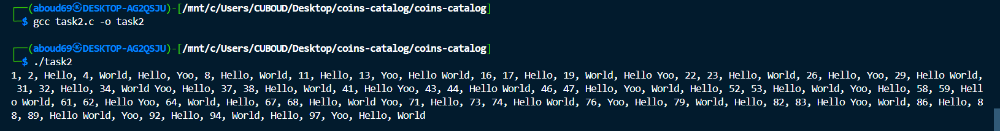
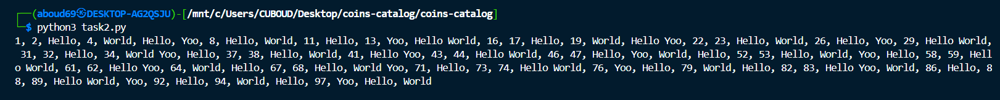

This is a [Next.js](https://nextjs.org/) project bootstrapped with [`create-next-app`](https://github.com/vercel/next.js/tree/canary/packages/create-next-app).

Demo: https://coins-catalog-beryl.vercel.app/

## Installing and running the app

First, clone the project and install the dependencies:

```bash
git clone https://github.com/AbdrrahimDahmani/fevertokens-tech-test.git

cd fevertokens-tech-test

pnpm  install
```

Copy the data inside the .env.exemple into .env.local and build the project

```bash
pnpm run build
```

then run the development server:

```bash
pnpm run dev --port=8000
```

Open [http://localhost:8000](http://localhost:8000) with your browser to see the result.

## Notice

Sometimes a CORS error occurs when you try to fetch the data from the "/coins/\${id}/market_chart?vs_currency=usd&days=7" endpoint. If you encounter this error, you can try refreshing the page and waiting for it to resolve. Alternatively, you can install the [CORS Unblock](https://chromewebstore.google.com/detail/cors-unblock/lfhmikememgdcahcdlaciloancbhjino) Chrome extension to bypass the error.

## Task 2

Here is the C code for `task2.c`:

```c
#include <stdio.h>
#include <stdio.h>

int main() {
    printf("%d,", 1);
    for (int i = 2; i <= 100; i++) {
        int printed = 0;
        if (i % 3 == 0) {
            printf(" Hello");
            printed = 1;
        }
        if (i % 5 == 0) {
            printf(" World");
            printed = 1;
        }
        if (i % 7 == 0) {
            printf(" Yoo");
            printed = 1;
        }
        if (!printed) {
            printf(" %d", i);
        }
        if (i < 100) {
            printf(",");
        }
    }
    printf("\n");
    return 0;
}

```

And here is the result:



Here is the Python code for `task2.py`:

```python
print(1, end=",")
for i in range(2, 101):
    printed = False
    if i % 3 == 0:
        print(" Hello", end="")
        printed = True
    if i % 5 == 0:
        print(" World", end="")
        printed = True
    if i % 7 == 0:
        print(" Yoo", end="")
        printed = True
    if not printed:
        print(" {}".format(i), end="")
    if i < 100:
        print(",", end="")
print()
```

And here is the result:



## Task3

First, I will choose an arbitrary direction, for example, right (East). I will drive for a certain time, let's say 1 hour. If I find my friend there, that's great. If not, I will turn back and drive in the opposite direction (West) for double the time, which would be 2 hours.

If I don't find my friend after driving West for 2 hours, I will then turn around and drive East again, this time for double the last amount of time, which would be 4 hours.

By following and repeating this approach, I can cover increasing distances in both directions, ensuring that I will eventually find my friend.
